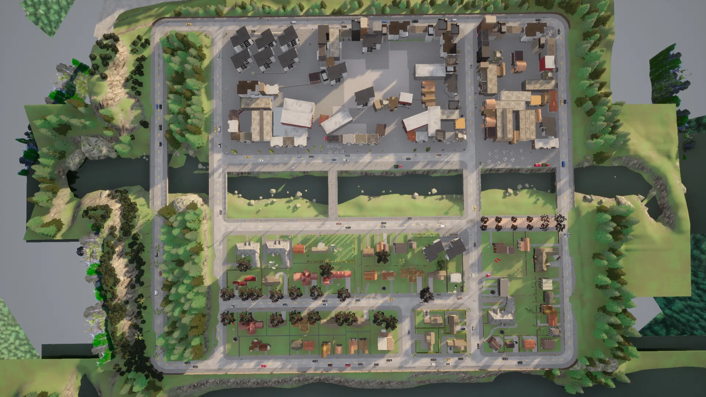
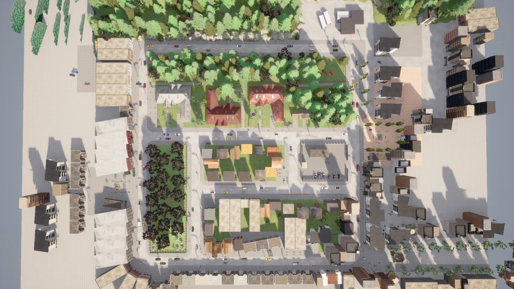
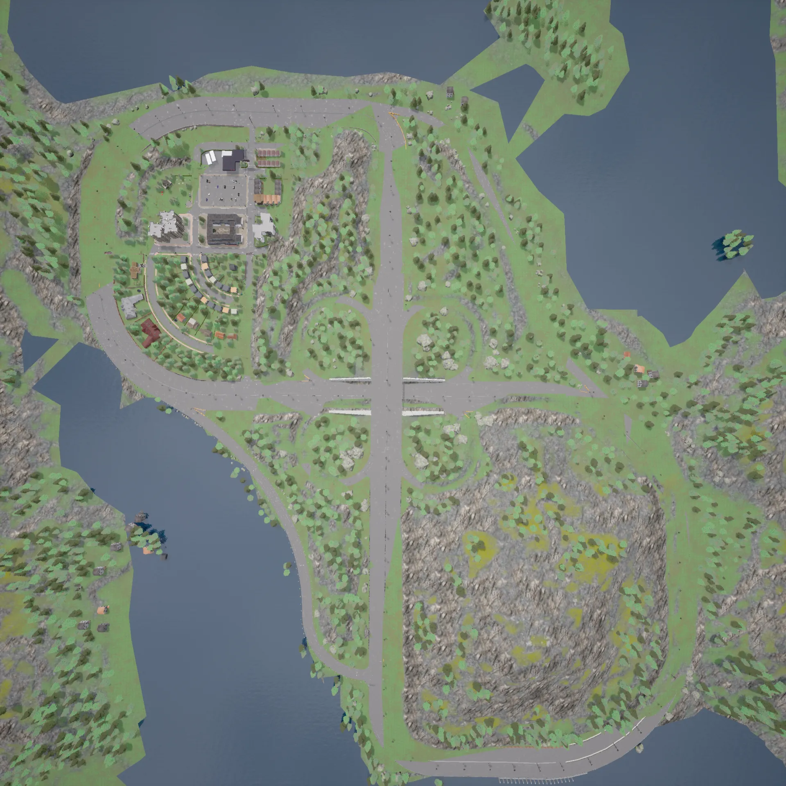
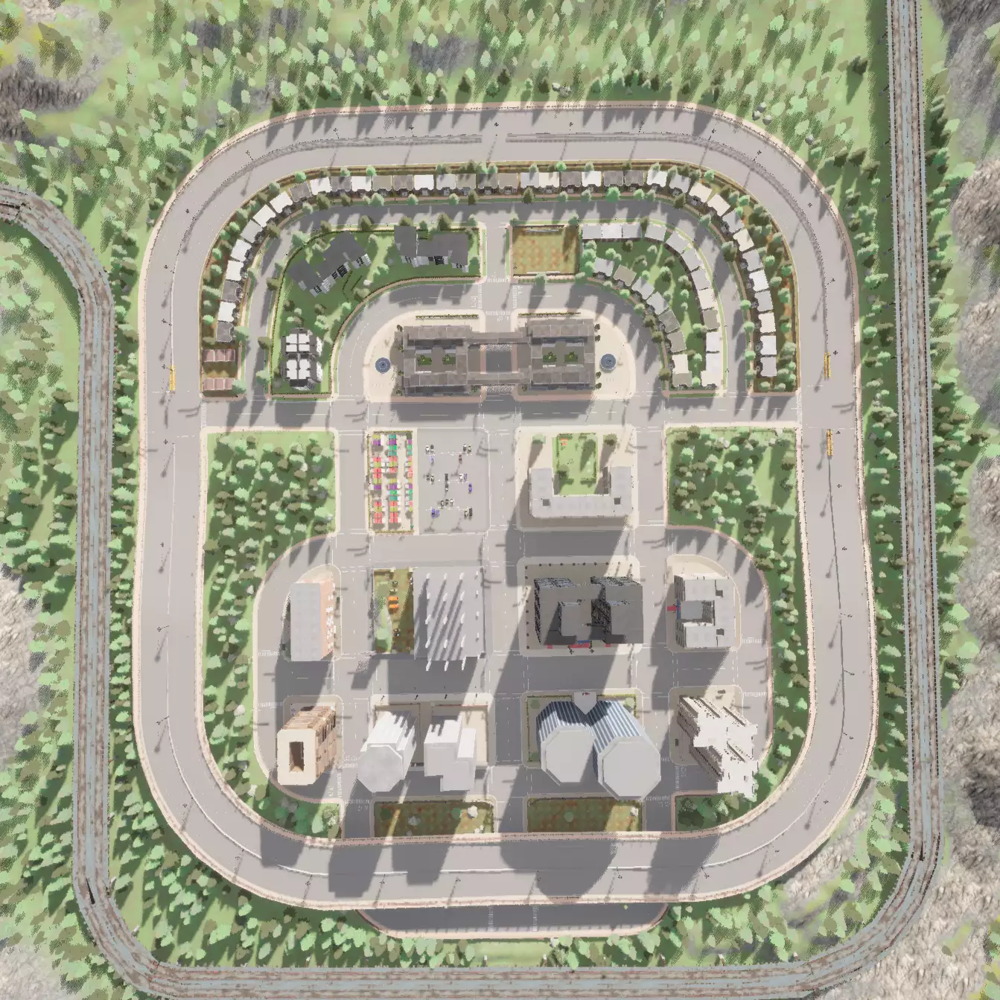
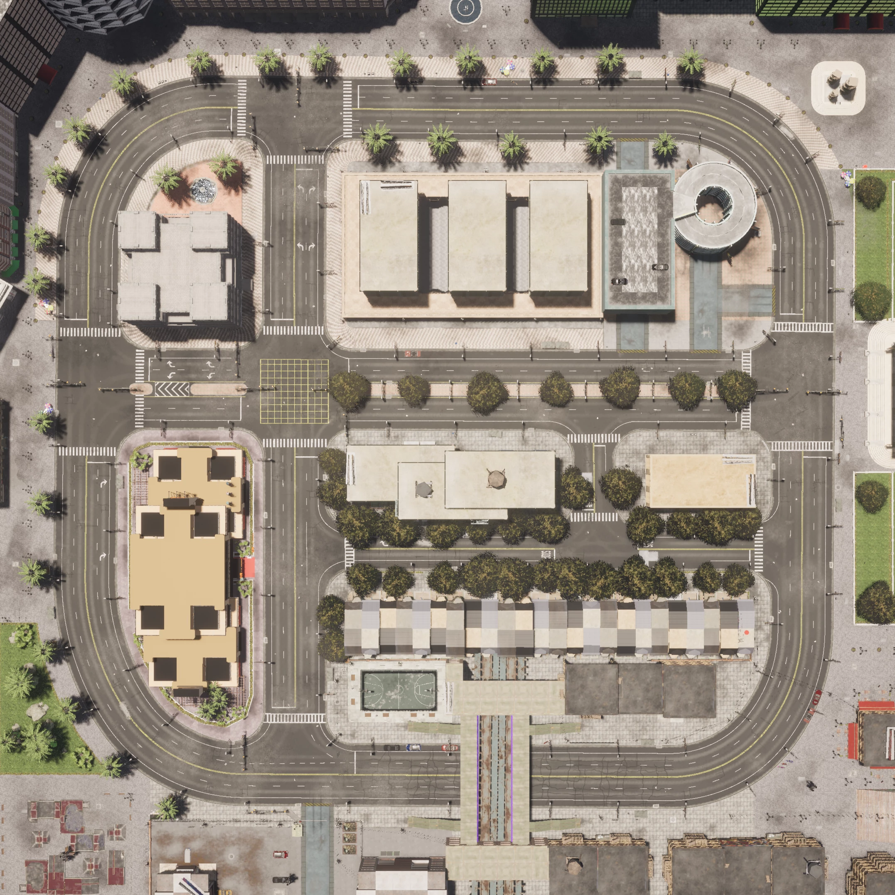
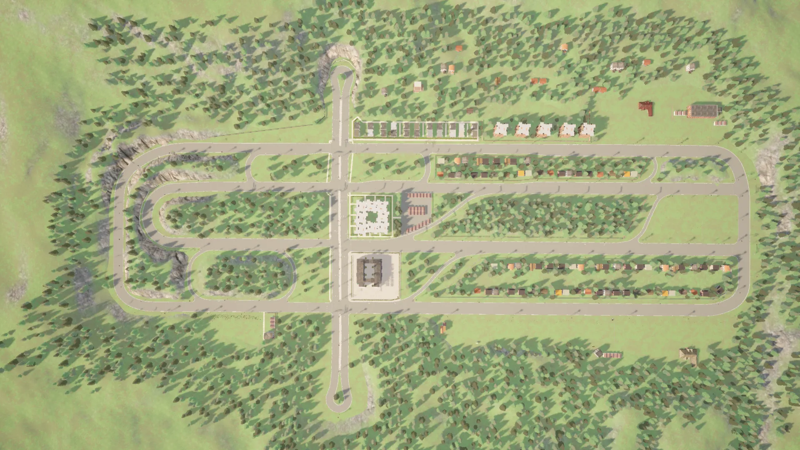
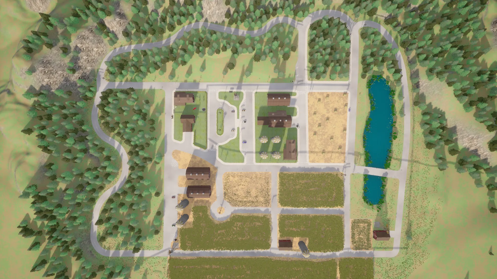

[//]: # (```text)

[//]: # (         _____       ___   _____    _           ___   _____   _____       ___   _____   _____   _____  )

[//]: # (        /  ___|     /   | |  _  \  | |         /   | /  ___/ /  ___|     /   | |  _  \ | ____| /  ___/ )

[//]: # (        | |        / /| | | |_| |  | |        / /| | | |___  | |        / /| | | |_| | | |__   | |___  )

[//]: # (        | |       / / | | |  _  /  | |       / / | | \___  \ | |       / / | | |  ___/ |  __|  \___  \ )

[//]: # (        | |___   / /  | | | | \ \  | |___   / /  | |  ___| | | |___   / /  | | | |     | |___   ___| | )

[//]: # (        \_____| /_/   |_| |_|  \_\ |_____| /_/   |_| /_____/ \_____| /_/   |_| |_|     |_____| /_____/ )

[//]: # (```)

[//]: # (<div align="center">)

[//]: # (<h1 style="font-family: 'Britannic Bold'; font-size: xxx-large; color: lightsteelblue">xxxScapes</h1>)

[//]: # (</div>)


# xxxScapes

xxxScapes dataset samples from [CARLA](http://carla.org) simulator involving 12 different Maps(Town01-Town07, Town10HD, Town11-Town13, Town15). 
Specifically, these maps imitate the real-world settings such as urban, suburban, highway, and rural areas.
The dataset contains 5000 images with 19 semantic categories and 9 custom categories. The dataset is divided into 4000 training images and 1000 testing images.

<div align="center">
    
    
    
</div>
<div align="center">
    
    
    
</div>
<div align="center">
    
    
</div>
<div align="center"> 
    <span style="font-size: small">
        Fig1: Town01,Town02,Town03,Town04,Town10,Town06 and Town07 
    </span> 
</div>

The original coordinates of the different maps are as follows:

| Town   | (X,Y,Z) | (Lat, Lon, Alt)  | Town     | (X,Y,Z) | (Lat, Lon, Alt)  |
|--------|---------|------------------|----------|---------|------------------|
| Town01 | (0,0,0) | (49.0, 0.0, 0.0) | Town07   | (0,0,0) | (49.0, 0.0, 0.0) |
| Town02 | (0,0,0) | (49.0, 0.0, 0.0) | Town10   | (0,0,0) | (49.0, 0.0, 0.0) |
| Town03 | (0,0,0) | (49.0, 0.0, 0.0) | Town11   | (0,0,0) | (49.0, 0.0, 0.0) |
| Town04 | (0,0,0) | (49.0, 0.0, 0.0) | Town12   | (0,0,0) | (49.0, 0.0, 0.0) |
| Town05 | (0,0,0) | (49.0, 0.0, 0.0) | Town13   | (0,0,0) | (49.0, 0.0, 0.0) |
| Town06 | (0,0,0) | (49.0, 0.0, 0.0) | Town15   | (0,0,0) | (49.0, 0.0, 0.0) |


### Quickstart

### Download Dataset

### Dataset Directory Structure

File naming format: `{town}_{timestamp}_{frame}_{type}.{suffix}`. 

```
xxxScapes
├── train
│   ├── Town01
│   │   ├── Town01_000010_074800_bounding_box.xml
│   │   ├── Town01_000010_074800_color.png
│   │   ├── Town01_000010_074800_gnss.json
│   │   ├── Town01_000010_074800_img.png
│   │   ├── Town01_000010_074800_instance.json
│   │   `── Town01_000010_074800_labelIds.png
│   ├── Town02
│   │   ├── ...
├── test
│   ├── Town15
│   │   ├── ...
`── README.md
```

### Color2LabelIds

The semantic categories are divided into 19 cityscapes classes (bold type) and 9 custom classes (italic form). The 19 cityscapes classes are the same as in the [CityScapes](https://www.cityscapes-dataset.com) dataset. 


| Tag               | Color          | LabelId | Tag            | Color           | LabelId | Tag          | Color           | LabelId |
|-------------------|----------------|---------|----------------|-----------------|---------|--------------|-----------------|---------|
| unlabeled         | (0,0,0)        | 0       | **terrain**    | (152,251,152)   | 10      | _static_     | (110,190,160)   | 20      |
| **road**          | (128,64,128)   | 1       | **sky**        | (70,130,180)    | 11      | _dynamic_    | (170,120,50)    | 21      |
| **sidewalk**      | (244,35,232)   | 2       | **pedestrian** | (220,20,60)     | 12      | _other_      | (55,90,80)      | 22      |
| **building**      | (70,70,70)     | 3       | **rider**      | (255,0,0)       | 13      | _water_      | (45,60,150)     | 23      |
| **wall**          | (102,102,156)  | 4       | **car**        | (0,0,142)       | 14      | _road line_  | (157,234,50)    | 24      |
| **fence**         | (190,153,153)  | 5       | **truck**      | (0,0,70)        | 15      | _ground_     | (81,0,81)       | 25      |
| **pole**          | (153,153,153)  | 6       | **bus**        | (0,60,100)      | 16      | _bridge_     | (150,100,100)   | 26      |
| **traffic_light** | (250,170,30)   | 7       | **train**      | (0,80,100)      | 17      | _rail track_ | (230,150,140)   | 27      |
| **traffic_sign**  | (220,220,0)    | 8       | **motorcycle** | (0,0,230)       | 18      | _guard rail_ | (180,165,180)   | 28      |
|  **vegetation**   | (107,142,35)   | 9       | **bicycle**    | (119,11,32)     | 19      |


### Reference

[1] [Cityscapes Dataset](https://www.cityscapes-dataset.com)

[2] [CARLA Simulator](http://carla.org)

[3] [carla-semantic-localization](https://github.com/lian999111/carla-semantic-localization/tree/c4844f2f6b8bbc21c8e3e4962954cf01eb673e85)